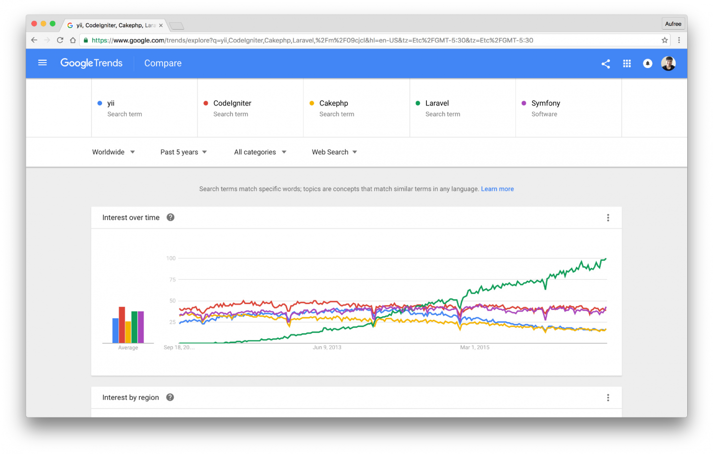
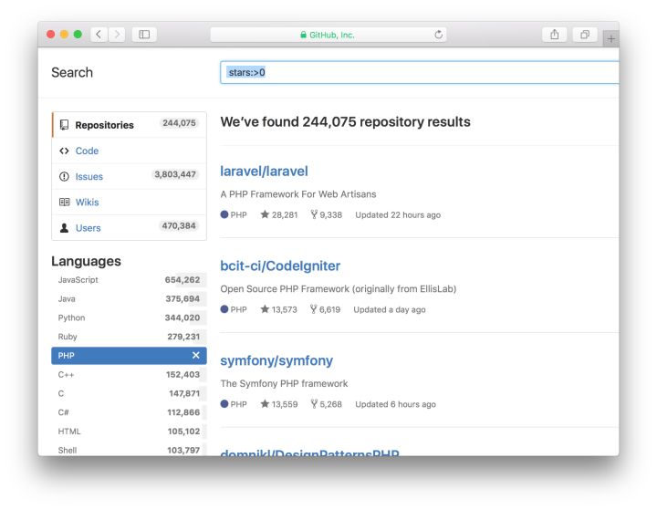
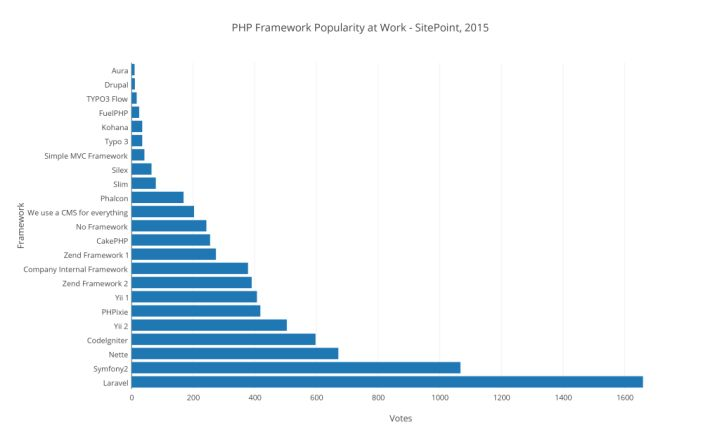

#LARAVEL 5.6 启程

> 后盾人 wwwhoudunren.com  作者：向军大叔

[TOC]

## 介绍

Laravel是一套简洁、优雅的PHP Web开发框架(PHP Web Framework)。它可以让你从面条一样杂乱的代码中解脱出来；它可以帮你构建一个完美的网络APP，而且每行代码都可以简洁、富于表达力。

Laravel 是 基于 PHP 语言的 Web 开源框架，采用了 MVC 的架构模式，在 2011 年 6 月正式发布了首个版本。
深度集成 PHP 强大的扩展包（Composer）生态与 PHP 开发者广大的受众群，让 Laravel 在发布之后的短短几年时间得到了极其迅猛的发展。我们通过 Google Trends 提供的趋势图（图 1.1）可以看出，Laravel 框架在过去十年，其增长速度迅猛。



**laravel是GitHub上PHP项目排名第一的**




编程网站 Sitepoint 上的用户调查第一名，链接： The Best PHP Framework for 2015: SitePoint Survey Results




## 版本

#### Lts

Long-Term Support,长期技术支持（版本），该版本拥有较长的维护周期，是商业项目优先考虑使用的版本。

#### 常规版

提供6个月的bug修复，维护周期短但功能较新，学习为了使用新功能可采用这个版本。


## 安装

homestead.yaml配置内容如下：

```
---
ip: "192.168.10.10"
memory: 2048
cpus: 1
provider: virtualbox

authorize: ~/.ssh/id_rsa.pub

keys:
    - ~/.ssh/id_rsa
    - ~/.ssh/id_rsa.pub

folders:
    - map: ~/code
      to: /home/vagrant/code

sites:
    - map: laravel.hd
      to: /home/vagrant/code/laravel/public

databases:
    - homestead
    - laravel
```

启动homestead，下面我是配置了homestead的全局命令所以可以使用homestead up启动

```
#启动 如果加上 --provision 选项那么添加的新站点会发布到虚拟机上。
cd ~/Homestead && vagrant up
```

进入homestead

```
homestead ssh
```

首先更换composer中国镜像

```
composer config -g repo.packagist composer https://packagist.phpcomposer.com
```

使用composer安装laravel框架

```

cd ~/code
composer create-project --prefer-dist laravel/laravel laravel
```

安装完 Laravel 之后，你必须将 web 服务器更目录指向 `public` 目录。该目录下的 `index.php` 文件将作为所有进入应用程序的 HTTP 请求的前端控制器。

如果访问域名 laravel.hd/ 出现下面页面，恭喜你 laravel安装成功了。

## 基本使用

####路由

laravel 的路由类型很多，为了对大家不造成学习压力。我们先讲解基础的使用，后面会深入讲到其他路由处理方式。

修改 routes/web.php 路由表文件。

```
Route::get('/home', 'TestController@home');
Route::get('/lists', 'TestController@lists');
Route::get('/show', 'TestController@show');
```

#### 控制器

创建控制器(也可以使用sublime 插件方式创建)

```
php artisan make:controller TestController
```

内容如下：

```
<?php

namespace App\Http\Controllers;

use Illuminate\Http\Request;

class TestController extends Controller
{
	public function home(){
		return __METHOD__;
	}

	public function lists(){
		return __METHOD__;
	}

	public function show(){
		return __METHOD__;
	}
}
```

浏览器中访问 `http://laravel.hd/lists ` 显示内容如下

```
App\Http\Controllers\TestController::lists
```

以上就是laravel中基本路由与控制器的操作流程。

#### 视图

视图就是我们显示的页面，视图保存在 `resources/views` 文件夹中。

#### 继承

模板继承是为了共用相同页面数据，减少代码冗余。

下面定义 views/layouts/master.blade.php 文件

```
<!DOCTYPE html>
<html lang="en">
<head>
	<meta charset="UTF-8">
	<title>
		@yield('title', '后盾人')
	</title>
</head>
<body>
	@yield('content')
</body>
</html>
```

然后在子模板中引入父模板，并使用section替换父模板中yield定义的占位内容。

```
@extends('layouts.master')
@section('title','后盾人 - 首页')
@section('content')
	<h1>首页1</h1>
@endsection
```


## 脚手架

安装cnpm 使用国内镜像，安装速度快。

```
npm install -g cnpm --registry=https://registry.npm.taobao.org
```

根据packagist.json 安装前端库

```
cnpm install
cnpm install cross-env
```

我们需要在 resources/assets 目录下的js 与 css 目录中编写前端文件。

**执行编译**

编写好文件事我们需要执行编译操作，生成可供浏览器访问的文件，默认生成在 public/css 与 public/js目录中

```
npm run dev
```

引入编译好的样式文件

```
<link rel="stylesheet" href="/css/app.css">
```

文件监听**

每次修改都手动编译效率很低，执行以下命令后Webpack 会在检测到文件更改时自动重新编译资源：

```
npm run watch
```

在某些环境中，当文件更改时，Webpack 不会更新。如果系统出现这种情况，请考虑使用 `watch-poll` 命令：

```
npm run watch-poll
```
**bootstrap**

在app.scss 文件中定义：

```
@import '~bootstrap/scss/bootstrap'; 
```

##路由别名

进入路由跳转使用 `/home` 等形式可以正常进行，但如果我们有很多页面 使用了这种方式，后期我们将 `/home` 更改为了 `/root`，就要修改多个页面，显然不是很方式 。这时我们可以为路由起别名。

```
Route::get('/home', 'TestController@home')->name('home');
```

页面中使用 `{{route('home')}}` 调用即可

```
<a class="nav-link" href="{{ route('home') }}">网站首页</a>
```

## 数据迁移

迁移就像是数据库的版本控制, 允许团队简单轻松的编辑并共享应用的数据库表结构。

迁移文件默认保存在 `database/migrations` 文件夹中。

> 课程使用homestead 配置，要保证.env配置正确，并保证主机客户端连接正常

**运行迁移**

使用 Artisan命令 `migrate` 方法来运行所有未完成的迁移：

```
php artisan migrate
```

**回滚迁移**

若要回滚最后一次迁移， 可以使用 `rollback` 命令。 此命令将回滚最后一次“迁移”的操作，其中可能包含多个迁移文件：

```
php artisan migrate:rollback
```

## 模型

Laravel 的 Eloquent ORM 提供了漂亮、简洁的 ActiveRecord 实现来和数据库交互。每个数据库表都有一个对应的「模型」用来与该表交互。你可以通过模型查询数据表中的数据，并将新记录添加到数据表中。

## 定义模型

首先，创建一个 Eloquent 模型，默认生成的模型通常放在 `app` 目录中。

创建模型实例的最简单方法是使用 [Artisan 命令](https://laravel-china.org/docs/laravel/5.6/artisan) `make:model`：

```
php artisan make:model Article
```

如果要在生成模型时生成 [数据库迁移](https://laravel-china.org/docs/laravel/5.6/migrations) ，可以使用 `--migration` 或 `-m` 选项：

```
php artisan make:model Article -m
```

**数据表名称**

可以通过在模型上定义 `table` 属性，来指定自定义数据表。如果不指定时使用模型名加s，如Article 对应表名为articles

```
 protected $table = 'articles';
```

**时间戳**

默认情况下，Eloquent 会默认数据表中存在 `created_at` 和 `updated_at` 这两个字段。如果你不需要这两个字段，则需要在模型内将 `$timestamps` 属性设置为 `false` ：

```
//该模型是否被自动维护时间戳
public $timestamps = false;
```

## TINKER

使用laravel提供的tinker 可以方便的在命令行进行调试。

**进入tinker环境**

```
php artisan tinker
```

**新增用户练习**

```
>>> use \App\User
>>> $user = new User
>>> $user->create(['name'=>'houdunren','password'=>bcrypt('admin888'),'email'=>'2300071698@qq.com'])
```

> bcrypt 是用来对密码进行加密

**查看用户**

```
>>> User::first()
>>> User::all()
```

**修改记录**

下面使用save方法操作

```
>>> $user = User::first()
>>> $user->name='后盾人网站'
>>> $user->save()

```

下面使用update批量更新

```
>>> $user = User::first()
>>> $user->update(['name'=>'后盾人','password'=>bcrypt('admin')])

```

## 路由参数

比如我们定义下面的路由规则，其中 {user} 和 {name} 为路由中的参数变量

```
Route::get('/user/{user}/{name}','UserController@show')->name('user.show');
```

控制器中获取参数方式如下:

```
<?php namespace App\Http\Controllers;
use Illuminate\Http\Request;
class UserController extends Controller
{
    public function show($user,$name){
    	dd($user.'='.$name);
    }
}
```


## 隐性路由模型绑定

Laravel 会自动解析定义在路由或控制器行为中与类型提示的变量名匹配的路由段名称的 Eloquent 模型。例如：

```
Route::get('api/users/{user}', function (App\User $user) {
    return $user->email;
});
```

在这个例子中，由于 `$user` 变量被类型提示为 Eloquent 模型 `App\User`，变量名称又与 URI 中的 `{user}` 匹配，因此，Laravel 会自动注入与请求 URI 中传入的 ID 匹配的用户模型实例。如果在数据库中找不到对应的模型实例，将会自动生成 404 异常。

## 资源控制器

Laravel 遵从 RESTful 架构的设计原则，将数据看做一个资源。Laravel 资源路由将典型的「CRUD」路由分配给具有单行代码的控制器。

使用 Artisan 命令 `make:controller` 来快速创建控制器：

```
php artisan make:controller ArticleController --resource
```

接下来，你可以给控制器注册一个资源路由：

```
Route::resource('photos', 'PhotoController');
```

**资源控制器方法说明：**

| 动作      | URI                    | 行为    | 路由名称       |
| --------- | ---------------------- | ------- | -------------- |
| GET       | `/photos`              | index   | photos.index   |
| GET       | `/photos/create`       | create  | photos.create  |
| POST      | `/photos`              | store   | photos.store   |
| GET       | `/photos/{photo}`      | show    | photos.show    |
| GET       | `/photos/{photo}/edit` | edit    | photos.edit    |
| PUT/PATCH | `/photos/{photo}`      | update  | photos.update  |
| DELETE    | `/photos/{photo}`      | destroy | photos.destroy |

> 可以使用 `php artisan route:list` 查看已经定义的路由

#### 指定资源模型

如果你使用了路由模型绑定，并且想在资源控制器的方法中使用类型提示，你可以在生成控制器的时候使用 `--model` 选项：

```
php artisan make:controller PhotoController --resource --model=Photo
```

#### 伪造表单方法

因为 HTML 表单不能生成 `PUT`、 `PATCH` 或者 `DELETE` 请求，所以你需要添加一个隐藏的 `_method` 输入字段来伪造这些 HTTP 动作。辅助函数 `method_field` 可以帮你创建这个字段：

```
{{ method_field('PUT') }}
```

## 表单

####表单验证

下面是控制器中的 store 方法

```
public function store(Request $request)
{
    $this->validate($request, [
        'title' => 'required|unique:posts|max:255',
        'body' => 'required',
    ]);

    // 文章内容是符合规则的，存入数据库
}
```

####常用规则

| 规则      | 说明说明                                                     | 示例                                    |
| --------- | ------------------------------------------------------------ | --------------------------------------- |
| confirmed | 验证的字段必须和 `foo_confirmation` 的字段值一致。例如，如果要验证的字段是 `password`，输入中必须存在匹配的 `password_confirmation` 字段。 |                                         |
| size      | 验证的字段必须具有与给定值匹配的大小。对于字符串来说，*value* 对应于字符数。对于数字来说，*value* 对应于给定的整数值。对于数组来说， *size* 对应的是数组的 `count` 值。对文件来说，*size* 对应的是文件大小（单位 kb ）。 |                                         |
| max       | 验证中的字段必须小于或等于 *value*。字符串、数字、数组或是文件大小的计算方式都用 [`size`](https://laravel-china.org/docs/laravel/5.5/validation#rule-size) 方法进行评估。 |                                         |
| min       | 验证中的字段必须具有最小值。字符串、数字、数组或是文件大小的计算方式都用 [`size`](https://laravel-china.org/docs/laravel/5.5/validation#rule-size) 方法进行评估。 |                                         |
| unique    | unique:*table*,*column*,*except*,*idColumn*验证的字段在给定的数据库表中必须是唯一的。如果没有指定 `column`，将会使用字段本身的名称 | 'email' => 'unique:users,email_address' |
| required  | 验证的字段必须存在于输入数据中，而不是空。如果满足以下条件之一，则字段被视为「空」：   该值为 `null`.  该值为空字符串。  该值为空数组或空的 `可数` 对象。  该值为没有路径的上传文件。 |                                         |
| email     | 验证的字段必须符合 e-mail 地址格式。                         |                                         |
| sometimes | **只有**在该字段存在时， 才对字段执行验证                    |                                         |
| nullable  | 如果你不希望验证程序将 `null` 值视为无效的，那就将「可选」的请求字段标记为 `nullable`，也可以理解为有值时才验证。 |                                         |

```
$request->validate([
    'title' => 'required|unique:posts|max:255',
    'body' => 'required',
    'publish_at' => 'nullable|date',
]);
```

在这个例子里，我们指定 `publish_at` 字段可以为 `null` 或者一个有效的日期格式。如果 `nullable` 的修饰词没有被添加到规则定义中，验证器会认为 `null` 是一个无效的日期格式。

> 更多验证规则使用时请查阅手册 https://laravel.com/docs/5.6/validation

####表单函数

**csrf**

laravel （跨站请求伪造），Laravel 为了安全考虑，会让我们提供一个 token（令牌）来防止我们的应用受到 [CSRF](http://d.laravel-china.org/docs/5.5/routing#csrf-protection)（跨站请求伪造）的攻击。放置在表单（form）体内。

```
{{csrf_field()}}
```

**old**

`old`函数获取一次性存放在session中的值，用在表单的value属性中。这样当我们输出错误回调页面时，原来输入的值还存在。

```
<input type="text" class="form-control" name="name" value={{old('name')}}>
```

####显示验证错误

如果表单验证失败，laravel会向分配错误信息到 `$errors` 中，那么我们就可在模板中使用以下代码展示验证错误。

```
@if (count($errors) > 0)
    <div class="alert alert-danger">
        <ul>
            @foreach ($errors->all() as $error)
                <li>{{ $error }}</li>
            @endforeach
        </ul>
    </div>
@endif
```

#### 安装中文语言包

默认表单提示是英文的，我们可以安装中文语言包进行汉化。

```
composer require caouecs/laravel-lang:~3.0
```

包含大多数语言，语言包位于`vendor/caouecs/larvel-lang/src` 目录中。

####使用

1. 根据需要复制语言包到 `resources/lang` 目录中。

2. 修改 `config/app.php` 配置文件

   ```
   'locale' => 'zh-CN',
   ```

#### 表单请求验证

面对更复杂的验证情境中，你可以创建一个「表单请求」来处理更为复杂的逻辑

```
php artisan make:request StoreBlogRequest
```

新生成的类保存在 `app/Http/Requests` 目录下。

```
<?php namespace App\Http\Requests;
use Illuminate\Foundation\Http\FormRequest;
class UserRequest extends FormRequest
{
    //权限验证
    public function authorize()
    {
        return true;
    }
    
    //验证规则
    public function rules()
    {
        return [
            'name'=>'required|max:20',
            'email'=>'required|email|unique:users|max:255',
            'password'=>'required|confirmed|min:5',
        ];
    }

    //提示信息
    public function messages()
    {
        return [
            'name.required' => '名称不能为空',
            'email.required'  => '邮箱不能为空',
        ];
    }
}

```

在控制器的方法中依赖注入就可以使用了

```
public function store(UserRequest $request){
    
}
```

## 重定向

`redirect` 函数返回一个 HTTP 重定向响应，如果调用时没有传入参数则返回 redirector 实例：

```
return redirect('/home');
return redirect()->route('route.name');
```

传递路由参数

```
$user = User::first()
return redirect()->route('user.show',[$user]);
```

假设路由规则为 `Route::get('user/show/{user}')` ，上例中的`[$user]`会自动提出 $user模型对象的主键做为路由参数。

## 闪存数据

有时候你仅想在下一个请求之前在 Session 中存入数据，你可以使用 `flash` 方法。使用这个方法保存在 Session 中的数据，只会保留到下个 HTTP 请求到来之前，然后就会被删除。闪存数据主要用于短期的状态消息：

```
session()->flash('status', 'Task was successful!');
```

判断与获取闪存数据

```
@if (session()->has($msg))
	{{session()->get($msg)}}
@endif
```

#### 公共提示消息

开发中经常用到消息提示，比如登录成功、退出成功等。使用 闪存数据 定义一个公共的提示信息组件，就可以解决这个问题。

**控制器**

```
public function store(UserRequest $request)
{
	session()->flash('success','注册成功，欢迎回家');
	return redirect()->route('user.show',[$user]);
}
```

公共消息模板  `resource/view/layouts/_message.blade.php` 

```
@foreach (['success','error','danger'] as $msg)
	@if (session()->has($msg))
		<div class="alert alert-{{$msg}}">
			{{session()->get($msg)}}
		</div>
	@endif
@endforeach
```

需要用到的页面能过 `@include` 引入即可

```
@include('layouts._message')
```

## 登录验证

使用 `Auth::attempt` 可以进行用户手动登录

```
public function authenticate()
{
	if (Auth::attempt(['email' => $email, 'password' => $password])) {
		// 认证通过...
		return redirect()->intended('dashboard');
	}
}
```

重定向器上的 `intended` 方法将重定向到用户尝试访问的 URL。如果该 URL 无效，会给该方法传递回退 URI。

传递历史表单，`withInput` 用于把历史表单返回给页面，这样页面中就可以使用 `old()` 函数显示历史输入数据了。

```
return redirect()->back()->withInput();
```

完整示例

```
class LoginController extends Controller
{
	public function store(Request $request){
		$user = $this->validate($request,[
			'email'=>'required',
			'password'=>'required',
		]);

		if(Auth::attempt($user)){
			return redirect('/');
		}else{
			session()->flash('danger','邮箱 或密码错误');
			return redirect()->back()->withInput();
		}
	}
}
```

判断用户是否已经登录

```
Auth::check();
```

如果需要将现有用户进行登录，可以使用用户实例调用 `login` 方法。可以实现用户注册完就登录。

```
$user = User::first();
Auth::login($user);
```

用户退出

```
public function logout(){
	Auth::logout();
	session()->flash('success','退出成功');
	return redirect()->route('login');
}
```


#### 资源路由传参

下面是资源路由中生成编辑资源url的方法。

```
{!! route('user.edit',$user->id) !!}
```
#### 历史跳转

 `intended` 方法将重定向到用户尝试访问的 URL。如果该 URL 无效，会给该方法传递回退 URI。比如当用户编辑资料时，但用户没有登录，会先跳到用户登录页面。使用intended 方法后登录成功后会回调到，编辑资料页面。如果没有历史，则跳转到 intended指定的参数路由。

```
return redirect()->intended('home');
```


## 模型观察器

Eloquent 的模型触发了几个事件，可以在模型的生命周期的以下几点进行监控： `retrieved`、`creating`、`created`、`updating`、`updated`、`saving`、`saved`、`deleting`、`deleted`、`restoring`、`restored`。事件能在每次在数据库中保存或更新特定模型类时轻松地执行代码。

如果要给某个模型监听很多事件，则可以使用观察器将所有监听器分组到一个类中。观察器类里的方法名应该对应 Eloquent 中你想监听的事件。 每种方法接收 model 作为其唯一的参数。Laravel 没有为观察器设置默认的目录，所以你可以创建任何你喜欢你的目录来存放：

**定义观察器**

下面是User模型的观察器

```
<?php namespace app\Observers;
use App\User;
class UserObserver{
	public function creating(User $user){
		$user->active_token = str_random(20);
	}
	public function saving(User $user){}
}
```

**声明观察器**

在模型或AppServiceProvicer服务提供者的 `boot` 方法执行以下代码

```
User::observe(UserObserver::class)
```

## 邮件

#### 配置

下面是针对 qq邮箱的配置，其他邮箱请自行参考。

登录 `mail.qq.com` 你的邮箱。查找 `设置>帐户>POP3/IMAP/SMTP/Exchange/CardDAV/CalDAV服务` 开启pop3并获取授权码。

可以在 `config/mail.php` 文件或.env开发文件中设置，下面是.env中的配置项

```
MAIL_DRIVER=smtp
MAIL_HOST=smtp.qq.com
MAIL_PORT=25
MAIL_USERNAME=2300071698@qq.com
MAIL_FROM_ADDRESS=2300071698@qq.com
MAIL_PASSWORD=aan2qgnjnoujbeajj
MAIL_ENCRYPTION=tls
```

> MAIL_PASSWORD为QQ邮箱提供的摄权码

#### Mailable

在 Laravel 中，每种类型的邮件都代表一个「Mailable」对象。这些对象存储在 `app/Mail` 目录中。如果在你的应用中没有看见这个目录，别担心，在首次使用 `make:mail` 命令创建 Mailable 类时这个目录会被创建。

```
php artisan make:mail regMail
```

```
<?php namespace App\Mail;
use Illuminate\Bus\Queueable;
use Illuminate\Mail\Mailable;
use Illuminate\Queue\SerializesModels;
use Illuminate\Contracts\Queue\ShouldQueue;
class RegMail extends Mailable
{
    use Queueable, SerializesModels;
	//公共属性可以模板中直接使用
    public $user;
	//构造函数
    public function __construct($user)
    {
        $this->user = $user;
    }

    public function build()
    {
        return $this->view('mails.reg');
    }
}

```

#### 发送

执行以下代码就可以发送邮件了。

```
\Mail::to(User::first())->send(new \App\Mail\RegMail(User::find(1)));
```

> to：指发送给谁，字段中必须存在 email和name，send: 指使用的邮件处理器