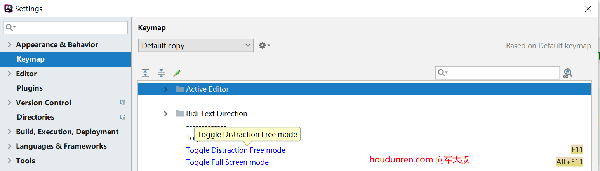
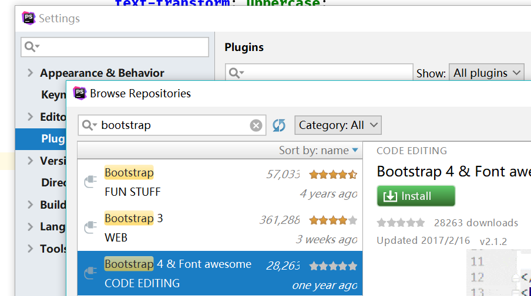
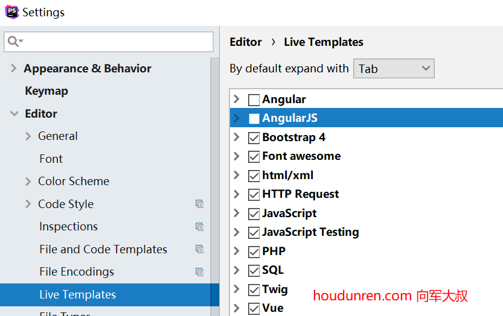
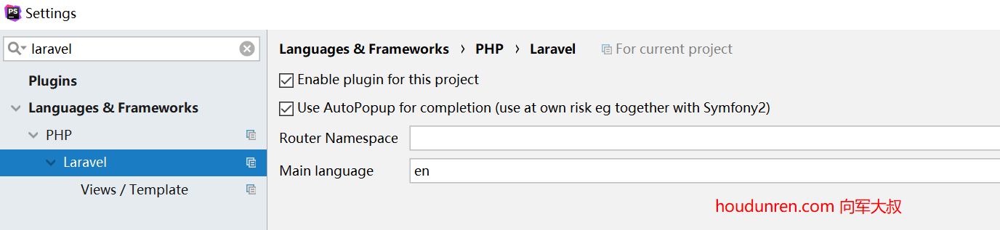
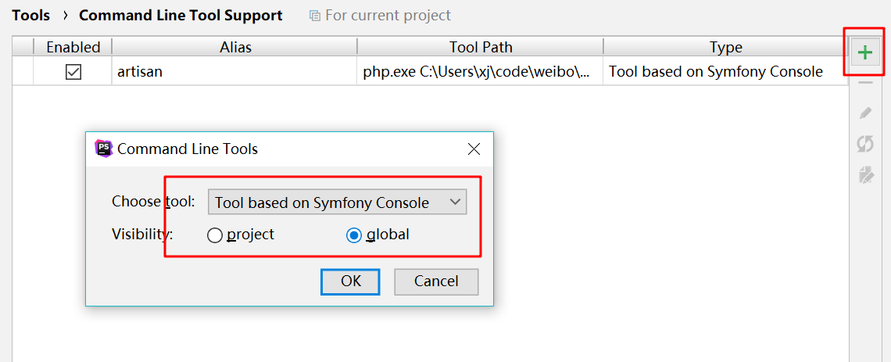
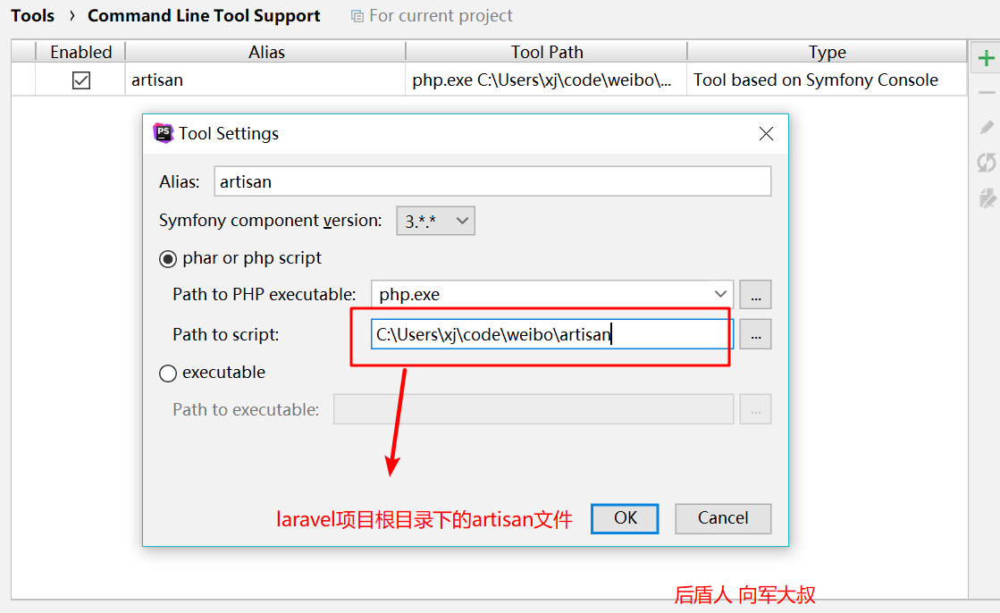
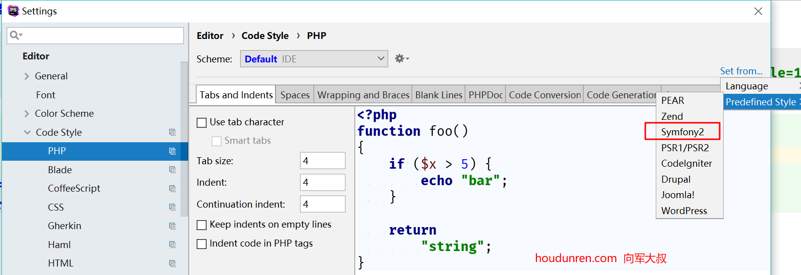

# PHPSTORM

下面在windows系统中介绍PHPSTORM使用,MAC使用与windows只是键盘布局差异。所以就不重复介绍了。 

#### 风格

1. 安装插件 `Material Theme UI  ` ，安装后重起phpstorm
2. `Tools -> Material Theme ` 中选择喜欢的样式就可以了

#### 快捷键 

 

1. 全屏幕快捷键 

   ```
   Keymap>Main menu>View>Toggle Distraction Free mode 为 f11健
   
   Keymap>Main menu>View>Toggle Full Screen mode 为 alt f11健
   ```

2. `Keymap>Tool Windows>Database`  数据库管理 `alt+d`

3. `Terminal` 快捷键就使用默认的 `alt+t`

4. `Remote Host` 远程主机面板 `alt+h`

5. `Run Command` 切换命令控制台 `alt+x` 

6. `File Structure` 查找文件定义的方法 `alt+j`  

7. ` Recent Files` 查找文件定义的方法 `alt+e`  

8. ` Navigate>File` 查找文件 `alt+p`  

9. `Editor Tabs>Close` 关闭文件 `alt+w`  

10. `Editor>Undo` 撤销操作 `alt+z`  

11. `File>Save All` 保存全部 `alt+s`  

#### bootstrap




#### 关闭angular提示

以前使用angular.js比较多，现在主要使用vue.js，所在angular.js的提示暂时不需要。

`settings>Editor>Live Templates`



### laravel plugin

在phpstorm中安装 `laravel plugin` 插件.

`Settings > Languages & Frameworks > PHP > Laravel `  点击开启 `Enable for this project`



#### laravel 代码提示

使用composer安装插件

```
composer require barryvdh/laravel-ide-helper
```

在 `config\app.php` 文件 providers 添加 

```
Barryvdh\LaravelIdeHelper\IdeHelperServiceProvider::class,
```

在 **app/Providers/AppServiceProvider.php** 文件中注册 

```
public function register()
{
    if ($this->app->environment() !== 'production') {
        $this->app->register(\Barryvdh\LaravelIdeHelper\IdeHelperServiceProvider::class);
    }
    // ...
}
```

生成代码跟踪支持 

```
php artisan ide-helper:generate
```

#### laravel artisan 命令提示

`settings>Tools>Command Line Tool Support` 





#### 修改代码风格

`Editor>Code Style>PHP` 点击 `Set From...`  ,我使用的是`Symfony2`



#### 

